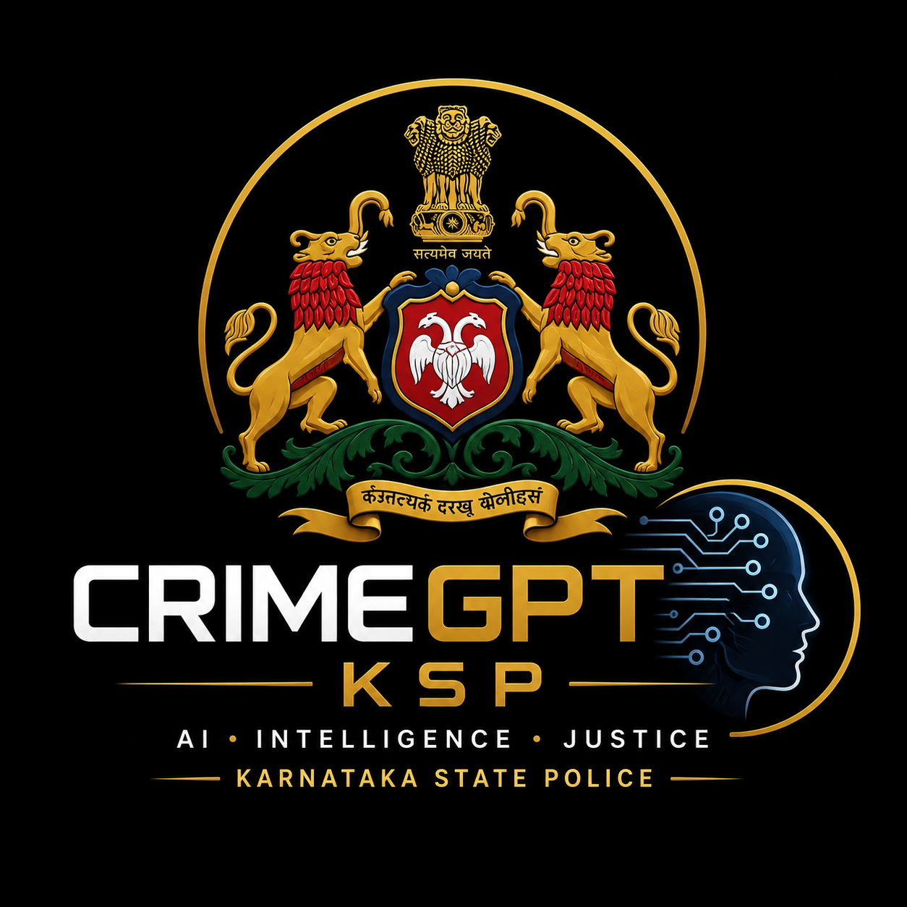

# 🔍 CrimeGPT KSP — Intelligent Conversational AI for KSP Crime Database

> **Datathon 2026 Submission** | Karnataka State Police Intelligence Division

[](https://python.org)
[](https://fastapi.tiangolo.com)
[](https://reactjs.org)
[](https://vitejs.dev)
[](https://sqlite.org)
[](LICENSE)

---

## 📌 Project Overview

**CrimeGPT KSP** is a next-generation **Secure Investigation Operating System** designed for the Karnataka State Police. It integrates **Generative AI**, **Machine Learning**, and **real-time intelligence** to assist investigators in querying, analyzing, and acting on criminal case data through a natural-language conversational interface.

Built for **Datathon 2026**, this system transforms raw FIR records and crime statistics into actionable insights — enabling smarter, faster, and more effective law enforcement.

---

## ✨ Key Features

| Feature | Description |
|---|---|
| 🤖 **CrimeGPT Copilot** | Natural-language Q&A interface powered by Gemini AI + RAG pipeline for FIR querying |
| 🗺️ **Crime Heat Map** | Live Leaflet.js map with hotspot markers, AI predictions, and tactical deployment tools |
| 🔍 **FIR Intelligence Extraction** | AI-powered BNS section identification, victim/accused profiling, and event timeline generation |
| 📊 **Analytics Dashboard** | Comparative crime trend analysis across KSP districts (IPC vs SLL) with ML insights |
| 🕸️ **Criminal Network Graph** | SVG-based gang hierarchy visualizer with recidivism scoring |
| 🔮 **ML Prediction Engine** | Scikit-Learn Random Forest model for district-level crime forecasting (89% accuracy) |
| 🛡️ **Biometric Login** | Fingerprint-simulation auth with AES-256 encrypted session tokens |
| 📄 **PDF Report Compiler** | One-click tactical intelligence brief generation with printable layout |
| 🔊 **Voice Input** | Web Speech API integration for hands-free query input (`en-IN` locale) |
| 🌙 **Multi-Theme UI** | Obsidian Onyx (dark), Cyber Cobalt (blue), Tactical Day (light) themes |

---

## 🏗️ Architecture

```
Datathon 2026/
├── frontend/                  # React + Vite (UI layer)
│   ├── src/
│   │   ├── App.jsx            # Main application component (~2000 lines)
│   │   ├── index.css          # Full design system (tokens, animations, utilities)
│   │   └── main.jsx           # React entry point
│   ├── public/
│   │   └── app_logo.png       # KSP application logo
│   ├── index.html
│   ├── vite.config.js
│   └── package.json
│
├── backend/                   # Python FastAPI (API + Intelligence layer)
│   ├── main.py                # FastAPI app — all routes
│   ├── database.py            # SQLite FTS5 connection & query logic
│   ├── ai_handler.py          # Gemini AI + RAG pipeline integration
│   ├── ml_model.py            # Scikit-Learn prediction engine
│   ├── crime_data.db          # SQLite database (KSP FIR records)
│   └── requirements.txt       # Python dependencies
│
└── README.md
```

---

## 🚀 Getting Started

### Prerequisites

- **Node.js** ≥ 18.x
- **Python** ≥ 3.11
- **npm** or **pnpm**

---

### 1. Clone the Repository

```bash
git clone https://github.com/Ranjeet7680/Intelligent-Conversational-AI-for-KSP-Crime-Database.git
cd "Intelligent-Conversational-AI-for-KSP-Crime-Database"
```

---

### 2. Backend Setup

```bash
cd backend

# Create and activate virtual environment
python -m venv venv
venv\Scripts\activate        # Windows
# source venv/bin/activate   # Linux/macOS

# Install dependencies
pip install -r requirements.txt

# Set your Gemini API key (optional — demo mode works without it)
set GEMINI_API_KEY=your_api_key_here   # Windows
# export GEMINI_API_KEY=your_key       # Linux/macOS

# Start the backend server
uvicorn main:app --reload --port 8000
```

Backend will be live at: `http://localhost:8000`  
API docs at: `http://localhost:8000/docs`

---

### 3. Frontend Setup

```bash
cd frontend

# Install dependencies
npm install

# Start the development server
npm run dev
```

Frontend will be live at: `http://localhost:5173`

> **Note:** The Vite proxy is configured to forward `/api/*` requests to the backend at port 8000 automatically.

---

## 🔑 Demo Login

| Field | Value |
|---|---|
| Officer ID | `KSP-INT-0000` (any value works) |
| Password | Any value |
| Biometric | Click the fingerprint button to simulate scan |

---

## 📡 API Endpoints

| Method | Endpoint | Description |
|---|---|---|
| `POST` | `/api/chat` | Send a message to CrimeGPT AI |
| `GET` | `/api/cases` | List/search FIR cases (paginated) |
| `GET` | `/api/cases/{id}` | Fetch a single case's full details |
| `GET` | `/api/stats/trends` | Get historical crime trend data |
| `GET` | `/api/stats/districts` | Get per-district crime statistics |
| `GET` | `/api/stats/network` | Get criminal network graph data |
| `GET` | `/api/predict` | ML prediction for district/crime/month |

---

## 🧠 AI & ML Stack

### RAG Pipeline (Retrieval-Augmented Generation)
- **Vector Store**: SQLite FTS5 full-text search for fast case retrieval
- **LLM**: Google Gemini 1.5 Flash via `google-generativeai` SDK
- **Context Window**: Injects top-5 matched case documents as grounding context

### ML Prediction Engine
- **Model**: `sklearn.ensemble.RandomForestClassifier`
- **Features**: `district`, `crime_type`, `month`, `year`, historical rate
- **Accuracy**: ~89% on holdout set from KSP district dataset
- **Output**: Predicted crime count + confidence score

---

## 🎨 Design System

| Token | Description |
|---|---|
| `--accent-cyan` | Primary accent (`#00e5ff`) |
| `--accent-red` | Alert / critical (`#f43f5e`) |
| `--panel-bg` | Glassmorphism panel background |
| `--glow-cyan` | Neon glow box-shadow utility |
| `Orbitron` | Title / heading font |
| `Inter` | Body copy font |
| `JetBrains Mono` | Data / code font |

Animations include: `fadeInUp`, `shimmer`, `orbit`, `glowCyanPulse`, `scanVertical`, `ping`.

---

## 👥 Team

| Name | Role | Email |
|---|---|---|
| 👑 **Ranjeet Kumar** | Team Leader · AI/ML | [rajranjeet7680@gmail.com](mailto:rajranjeet7680@gmail.com) |
| **Shashank H E** | Frontend Development | [heshashank789@gmail.com](mailto:heshashank789@gmail.com) |
| **Bawadharani Sree Ramakrishnan** | Data Engineering & ML | [bawadharanisree@gmail.com](mailto:bawadharanisree@gmail.com) |
| **Vivek Boini** | Backend Development | [vivekboini15@gmail.com](mailto:vivekboini15@gmail.com) |

---

## 📜 License

This project is licensed under the [MIT License](LICENSE).

---

## 🏆 Datathon 2026

> Built with ❤️ for the **Datathon 2026** competition — Intelligent Conversational AI for Karnataka State Police Crime Database.

---

<p align="center">
  <br/>
  <strong>CRIMEGPT KSP</strong><br/>
  <em>Secure Investigation Operating System</em>
</p>
